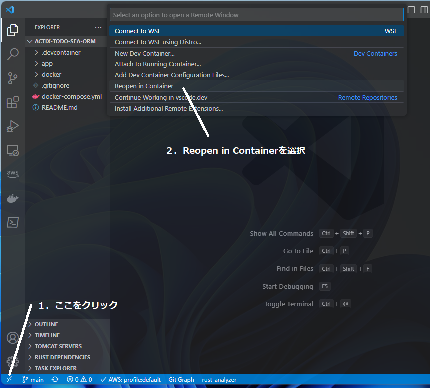
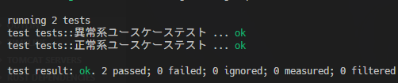
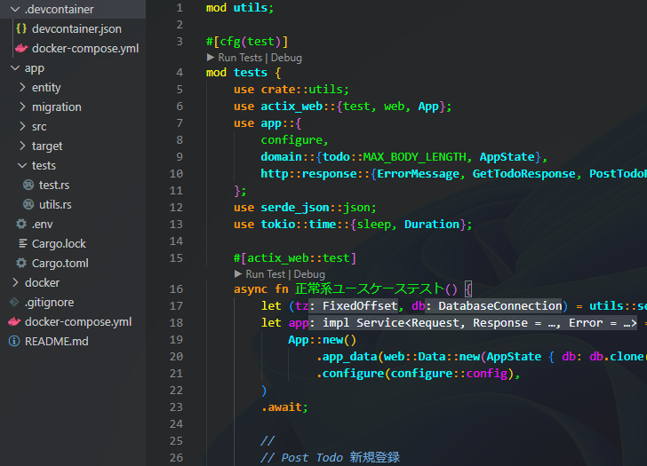

# actix-web,sea-ormでテストできるtodoアプリのapi作成

rustでwebアプリケーションを作る際の自分用雛形として作成。  
rustのwebフレームワークはactix-webを採用。dbのマイグレーションはsea-ormを採用しています。
自動テスト実行時はsqliteデータベースを利用して実行されます。

* [actix-web.rs](https://actix.rs/)
* [sea-orm](https://www.sea-ql.org/SeaORM/)


### ローカル環境での実行方法
※Windows11,Docker-Desktop環境で動作確認済みです。
※vscode拡張機能devcontainerを使用します。

1. git clone https://github.com/TOnodera/actix-todo-sea-orm.git
2. devcontainerで「reopen in container」を選択する。

3. cd /workspace/app && cp .env.example .env
4. cd /workspace/app && sea-orm-cli migrate upでＤＢが作成されます。
5. cd /workspace/app && cargo testで自動テスト実行。

6. vscode拡張機能を.devcontainerで設定しているのでUIからテストを実行することも可能です。


### api実行方法

cd /workspace/app && cargo run
↑でサーバが起動します。
開発時は
cargo watch -x run
でwatchさせることができます。

### Rest仕様
* Todo新規登録 Post /todo
```
{
    "title": "新規タスク",
    "body": "タスクの詳細..."
}
```
* Todo更新 Patch /todo/{id}
```
{
    "title": "新規タスク",
    "body": "タスクの詳細..."
}
```
* Todo取得 Get /todo/{id}
* Todo一覧取得 Get /todos
